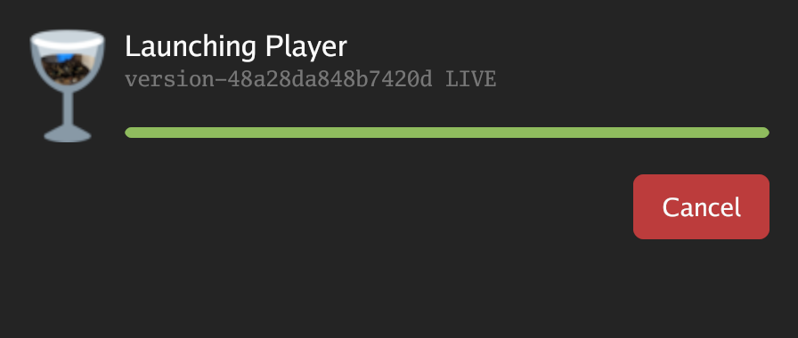
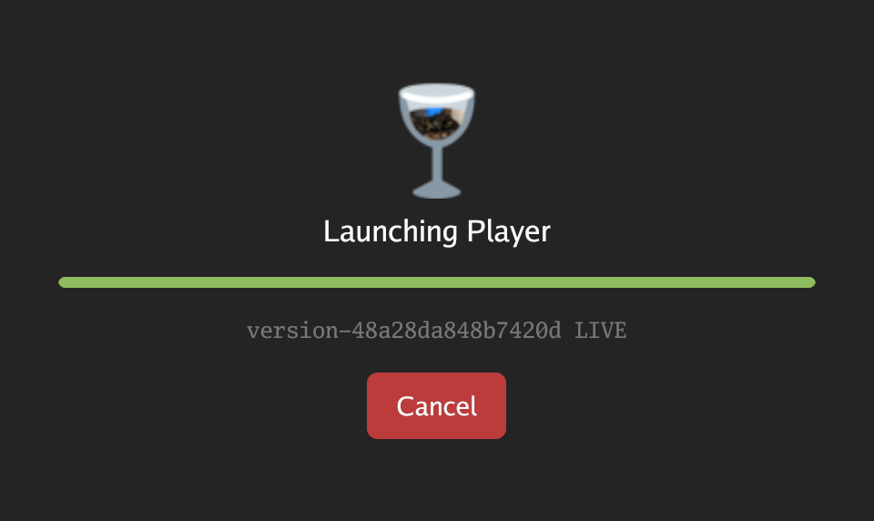

# Configuration

To adjust Vinegar or Roblox's behavior, the configuration may be edited. This is done through a configuration file. To edit this file, you may follow the steps below.

> **Note:** You only need to edit the configuration file if you want to fine tune Roblox's behavior. Having a configuration file is completely optional!

## Editing the configuration

Anything added to the configuration file is an override over the default configuration.

The configuration file (`config.toml`) may be easily edited by running the `vinegar edit` command. By using the `edit` command, error validation is also included.

If using Flatpak, the command is `flatpak run org.vinegarhq.Vinegar edit`.

If getting an error about an `EDITOR` variable, this can be temporarily fixed by running the command as `export EDITOR=nano; vinegar edit` (which will cause the `nano` editor to be used). Though, it is preferrable to set an `EDITOR` variable permanently, in a place like `.bashrc`.

## Configuration Values

| Name                 | Description                                                                                                 | Default |
| -------------------- | ----------------------------------------------------------------------------------------------------------- | ------- |
| `multiple_instances` | allow for multiple instances of Roblox to be running simultaneously; requires setting `WINEESYNC` to `"0"`. | `false` |
| `sanitize_env`       | sanitize the global environment, hand-picked variables are allowed through.                                 | `false` |

If you're using the Flatpak, ensure that the path of the `wineroot` configuration option is allowed access from the Flatpak, as if it is a path outside of `~/.var/app/org.vinegarhq.Vinegar` Vinegar won't be able to access the directory: `flatpak override --user --filesystem=/path/to/wineroot`

| Section    | Description                                    |
| ---------- | ---------------------------------------------- |
| `[player]` | Binary configuration for Player                |
| `[studio]` | Binary configuration for Studio                |
| `[env]`    | Global environment                             |
| `[splash]` | Configuration for the loading screen of Vinegar |

### Binary Configuration

This section are the available options for the Studio and Player configurations, they are specified under their sections as listed above.

| Option             | Description                                                                                                | Default            |
| ------------------ | ---------------------------------------------------------------------------------------------------------- | ------------------ |
| `dxvk_version`     | the DXVK version to be used; this can be set to legacy DXVK for old GPUs that don't support modern Vulkan. | `"2.3"`            |
| `wineroot`         | the path to a valid Wine 'root' installation directory.                                                    | none               |
| `channel`          | the deployment channel to be used; **DO NOT CHANGE, ONLY KEPT FOR DEVELOPERS**                             | `"LIVE"`           |
| `launcher`         | the program that is used to launch Wine when launching Roblox; this can be set to `gamemoderun`.           | none               |
| `renderer`         | selects the rendering engine to be used by Roblox via FFlags.                                              | `"D3D11"`          |
| `discord_rpc`      | use Discord's rich presence alongside handling the BloxstrapRPC protocol.                                  | Player: `true`     |
| `forced_version`   | forces Vinegar to use a specific version, the release channel must be adjusted for the version.            | none               |
| `dxvk`             | automatically uses DXVK for the application and installs if necessary.                                     | `true`             |
| `gpu`              | the GPU which Vinegar should use for running Roblox, see below table for valid values.                     | `"prime-discrete"` |
| `gamemode`         | automatically enable gamemode via D-Bus desktop portals.                                                   | `true`             |

The renderer must be one of the following: `"OpenGL"`, `"D3D11FL10"`, `"D3D11"`, `"Vulkan"`;
when using DXVK, ensure that the renderer is `"D3D11"`, otherwise Roblox will not utilize DXVK.

Rich presence for Studio may not function correctly, as the BloxstrapRPC protocol had only been implemented for Player; keep in mind that Discord RPC includes telemetry by default.

Sub-sections for FFlags and environment variables are specified with the section (eg. `[player.env]`)

| Sub-section | Default                                     |
| ----------- | ------------------------------------------- |
| `[fflags]`  | Player: `DFIntTaskSchedulerTargetFps = 640` |
| `[env]`     | none                                        |

Refer to the following table for valid `gpu` values:

| Value              | Effect                                                                                                                                                    |
| ------------------ | --------------------------------------------------------------------------------------------------------------------------------------------------------- |
| `"prime-discrete"` | Runs Roblox with your discrete gpu.                                                                                                                       |
| `"integrated"`     | Runs Roblox with your integrated graphics.                                                                                                                |
| `""`               | Skip logic; leave gpu choice up to your Vulkan/OpenGL drivers. Vulkan typically chooses the fastest gpu in your system, while OpenGL chooses the default. |
| `"<int>"`          | Runs Roblox with the gpu corresponding to the given index.<br/>Use the `sysinfo` command to show a list of gpus in your system and their indexes.         |

On non-PRIME systems, `"prime-discrete"` and `"integrated"` have the same effect as `""`.

### Splash Configuration

| Option       | Description                                                     | Default     |
| ------------ | --------------------------------------------------------------- | ----------- |
| `enabled`    | show the splash window when opening Roblox.                     | `true`      |
| `logo_path`  | logo file path used to load and render the logo.                | N/A         |
| `style`      | style for the splash window's layout.                           | `"compact"` |
| `background` | background color for the splash window.                         | `0x242424`  |
| `foreground` | font color for text on the splash window.                       | `0xfafafa`  |
| `cancel`     | accent color for 'Cancel' buttons.                              | `0xbc3c3c`  |
| `accent`     | accent color for progress bars and action/confirmation buttons. | `0x8fbc5e`  |
| `track`      | background color for progress bars.                             | `0x303030`  |
| `info`       | background color for text containing binary information.        | `0x777777`  |

The  following styles are available:

| Style        | Look                       |
| ------------ | -------------------------- |
| `"compact"`  |   |
| `"familiar"` |  |

The colors are in hexadecimal format, stored as numbers internally such as `0xff00ff`.

### Example configuration

> **Note:** The following configuration file is not meant to be copied or used. It is only shown for demonstrating how the configuration values above are laid out in the actual file.

```toml
# DO NOT COPY, USE ONLY AS EXAMPLE

[env]
WINEFSYNC = "1"

[player]
wineroot = "/home/meow/wine-ge"
launcher = "gamemoderun"
dxvk = false
renderer = "Vulkan"

[player.env]
DXVK_HUD = "0"
MANGOHUD = "1"

[player.fflags]
DFIntTaskSchedulerTargetFps = 144

[studio]
renderer = "OpenGL"
```
