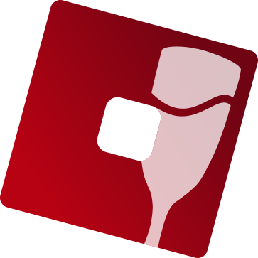

  
  

## Welcome to the home of the VinegarHQ project!

Here, you'll find documentation for Vinegar and Sober.

- Sober is an experimental software interoperability layer, which lets users run *Roblox Player* on Linux.
- The homepage and installation page for Sober can be found [here](https://sober.vinegarhq.org/).
  
- Vinegar is a fast and robust bootstrapper for *Roblox Studio* that has many ease-of-use features.
- The software and documentation are both open source, which can be accessed [on GitHub](https://github.com/vinegarhq).

The Discord server of VinegarHQ can be found [here](https://discord.gg/dzdzZ6Pps2).

---

_Roblox® is a registered Roblox Corporation trademark. VinegarHQ is not affiliated with Roblox Corporation._
