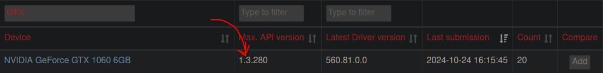

# Sober FAQ


## Q: Why Does this exist?
A: Because people on Linux still want to be able to play Roblox easily.


## Q: How do I know I meet the requirements to run Sober?
- If you know your CPU very well, any CPUs that is from 2008+ for Intel (Nehalem series or later) or 2011+ for AMD (Bulldozer series or later) should be fine.
    - If you don't know if your CPU supports SSE4.2, you can run `rep "sse4_2" /proc/cpuinfo` on your terminal. If SSE4.2 is available, it should be highlighted when you run the command.
- For RAM, you should check on your system monitoring application and see the under-load 
- For GPU, check the next question.
- For Flatpak installation, simply run `flatpak` on your terminal and it should come out with the following:

```console
error: No command specified

See 'flatpak --help'
```

## Q: Is the [GPU here] compatible?
A: If it was made in the last 8 years or so and has Vulkan support either in Mesa or Nvidia drivers, then yes. If you're not sure, check [GPUInfo](https://vulkan.gpuinfo.org/) and search your graphics card. If it doesn't support Vulkan, Sober should automatically switch to OpenGL. If it doesn't automatically switch, set `use_opengl` to `true` in `~/.var/app/org.vinegarhq.Sober/config/sober/config.json`. If it still doesn't work, you're out of luck.



## Q: I can't log in to Roblox!
A: If it didn't say explicitly you have a wrong password or something like that, reopen Sober and check if it logged you in. If that didn't work, try **"Login with Another Device"** on the login page.


## Q: Studio support?
A: Roblox does not have Studio for Android. Use [Vinegar](https://vinegarhq.org/) for Roblox Studio, which uses the Windows version of Roblox Studio with Wine.


## Q: Why is Sober closed source?
A: When the development team was making Sober, they wanted to ensure it wouldn't meet the same fate as Vinegar (being blocked). They recommended to make Sober closed source, to ensure no Exploit developers abuse it. Sadly, this is a necessary measure to ensure the continued existence of Roblox on Linux. On the bright side, this ensures that Sober will not be blocked in the long term, if no exploits are made for it, which the dev team will ensure.

### SQ: Wasn't Roblox working on Hyperion for Android? What happens then?
A: That's correct. Despite progress appearing to be slow, it's very likely that Hyperion gets deployed on Android during 2025, possibly within Q1. Once this happen, Sober will probably be discontinued.


## Q: Roblox is crashing after around 5-10 minutes in game!
A: There are various issues that could cause this. (You can check [the list of common issues](../Troubleshooting/index.md#known-general-issues)) Mostly, if you're on Wayland it's because Wayland support isn't great at the moment so you'll want make Sober use XWayland. To do this, you can simply run ```flatpak override --user --socket=x11 --nosocket=wayland org.vinegarhq.Sober```. Alternatively, if you prefer a GUI for managing flatpak permissions, you can use [Flatseal](https://flathub.org/apps/com.github.tchx84.Flatseal). And if you're on X11, don't know how to help you.


## Q: ARM64 support?
A: We currently have no plans to support ARM64. It'd take a huge amount of time and effort we can't spare. However, this isn't definitive and could be reconsidered in the future.


## Q: Will Sober be released on Flathub?
A: No. Releasing Sober on Flathub implies that Sober is ready for production use, and that Sober is likely to keep on working for the long term. Sober isn't a production use-ready software because it's not supported, and support could stop at any time for any reason.


## Q: Does it work with VR?
A: No, as the Android version doesn't have support for VR. The Quest version is only on built on ARM and under a translation layer, it performs horribly.


## Q: I'm running into an issue which isn't listed here or in the troubleshooting page. What should I do?
A: More often than not, simply restarting Sober or updating it to the latest version fixes the issue. If it persists, consider reporting it in VinegarHQ's Discord Server.
