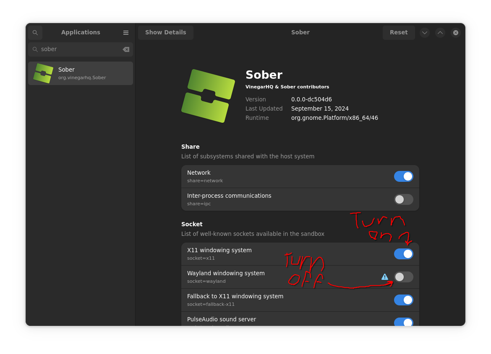

# Troubleshooting Sober

If there are any undocumented issues, feel free to [create an issue](https://github.com/vinegarhq/vinegarhq.github.io/issues/new/choose) to update the documentation!

---

## Obtaining logs

You should know what error you are getting before asking for any help. Logs usually give out signs of what the error is.

There are two ways of obtaining logs when running Sober:

- Run Sober on the terminal (`flatpak run org.vinegarhq.Sober`)
- Get the log file at `~/.var/app/org.vinegarhq.Sober/data/sober/appData/logs`

---

## Known General Issues

### It says Roblox is out of date (Error 280), but Sober isn't updating!
It means that the Roblox build Sober is in has reached it's end of the lifespan. If you are reading this, and Sober hasn't been updated, please wait until they do. Otherwise, you will have to run `flatpak update`.

> This is actually an uncommon issue, since it only happens once every approximate two weeks to a month if Sober is left without an update to a newer Roblox build, but this is just here in case it happens.
> Sober uses a fixed-point release system, which means only one Roblox build is supported at a time per Sober update and there are no automatic updates to the next build. Manually attempting to update Roblox will not work since it requires a specific build version in order to install.

<details>
  <summary>Roblox build estimated cutoff table</summary>
  This table provides an estimated range when Roblox cuts out a build. Roblox builds typically last approximately a month before Roblox cuts out the build from being accepted to the servers.

| Build #                          | Build release date | Supported? | Estimated cutoff range             | Actual cutoff date |
| -------------------------------- | ------------------ | ---------- | ---------------------------------- | ------------------ |
| 655                              | 01/09/25           | Yes        | 02/04/25 - 02/08/25                | TBD                |
| 656                              | 01/16/25           | Yes        | 02/13/25 - 02/18/25                | TBD                |
| 657                              | 01/24/25           | Yes        | 02/20/25 - 02/28/25                | TBD                |
| 658                              | 01/31/25           | Yes        | 02/24/25 - 03/08/25*               | TBD                |
| 659 **(Current Sober build)**    | 02/06/25           | Yes        | 03/10/25 - 03/15/25                | TBD                |
  
  **cutoff estimation was pushed two weeks forward from the initial esimation due to holiday vacation
  *this estimation is a week further due to a slightly shorter month
</details>


### RBXCRASH: OutOfMemory (Failed to allocate memory. size = [x], alignment = [y])

That means your graphics card ran out of video memory that Sober is trying to load on. This is especially problematic for NVIDIA users because the drivers have terrible written Linux drivers for VRAM handling. (There has been reports of Intel Haswell and earlier iGPU users facing issues like this too)

The main culprit behind this is basically due to textures being loaded at the highest quality possible, which is the default setting.

#### Solution
The solution below should be applied automatically once the crash is first detected.

If it doesn't, append the following FFlags into the `"fflags"` section at `~/.var/app/org.vinegarhq.Sober/config/sober/config.json`
```json
"DFIntTextureQualityOverride": 2,
"DFFlagTextureQualityOverrideEnabled": true
```

If it doesn't work, set the `"DFIntTextureQualityOverride"` FFlag to `1` instead. Otherwise, you might be out of luck.

> Essentially, to avoid this problem without downscaling textures, you would need an NVIDIA GPU that has 4 GB or greater VRAM. Alternatively, you could also use a Mesa capable GPU (AMD/Intel).


### I was kicked due to "Unexpected client behavior" (Error 268)
There has been recent reports after Sober was recently updated. (Commit `0.0.0-379b6ec`) It is suspecteed that Roblox is slowly enabling Hyperion onto its Android builds, but it is not fully confirmed and only applies to some games. While it is unlikely you will be banned for using Sober, the software cannot guarantee the support statuses of some games.

#### Known games affected
- Anime Vanguards


### ERROR: Wayland display connection closed by server (fatal)
Sober's Wayland backend isn't as stable as the X11 one. Check if the issue still occurs with the X11 backend.

#### Solution
Run ```flatpak override --user --socket=x11 --nosocket=wayland org.vinegarhq.Sober```

OR

Install flatseal and:
- Disable the wayland socket
- Enable the X11 sockets



> This problem should be fixed in Sober version `0.0.0-9619e88`. If there is an issue, you should report it on VinegarHQ's Discord server.


### Error 71 (Protocol error) dispatching to Wayland display
GTK sometimes messes up Wayland calls for some people. Most people should be fine.

#### Solution
See above.

> This problem should be fixed in Sober version `0.0.0-9619e88`. If there is an issue, you should report it on VinegarHQ's Discord server.


### FMOD API error
Roblox uses FMOD improperly, resulting in FMOD errors sometimes being spammed into the FLog. These errors happen on real Android devices as well, and are usually not a problem.

#### Affected games
- [Rivals](https://www.roblox.com/games/17625359962)
- [a dusty trip](https://www.roblox.com/games/16389395869)


### Sober just randomly crashes
Depends on if the logs actually provided something useful. Otherwise, we cannot give a definite answer.


### It says Sober couldn't launch because my card does not support Vulkan
Please see question #3 on [the FAQ](https://soberdocs.github.io/docs/FAQ.html#q-is-the-gpu-here-compatible). Otherwise, you will have to use OpenGL.


### Sober does not launch on my outdated system
Sober only supports Linux kernel version 5.11 and above. If you are on an outdated version of your distro, your kernel might be too outdated to run Sober.

#### Solution
Update your distro to a newer version by following a distro-specific guide.


### Sober does not launch to my dedicated GPU
GPUs using Mesa should be fine as long as it's recent. If you're using an NVIDIA card, the driver version installed on your system must match with the Flatpak NVIDIA drivers that is installed on the system. (For example, the installed 560 system drivers cannot run with NVIDIA Flatpak 555 drivers)

#### Solution
You can update by typing `flatpak update` on your terminal.


### I'm running a virtual machine, but I cannot launch Sober!
Virtual machines are not generally supported. Unless you can passthrough the GPU, it's advised against so to try and run Sober on a virtual machine.

> It kinda does have support, depending if the VM host you're running has OpenGL support, but you're going to get terrible performance out of it.


### I cannot install Sober on an ARM64 machine
That's because there isn't any support for ARM devices at the moment. There is no solution to this at the moment, but you're free to try [box64](https://github.com/ptitSeb/box64) and see if that works.


### I launched Sober through the browser. It says I cannot join a game because I don't have the permission to do so! (Error 524)
If you haven't logged into Sober, you should do it now. Afterwards you will be able to join from the browser for future sessions. (Please see question #4 on [the FAQ](https://soberdocs.github.io/docs/FAQ.html#q-i-cant-log-in-to-roblox) for more information) Otherwise, it could be just a generic 524.

> Sober does not launch the same way as it usually does on Windows or macOS. Sober will only carry over the join game request, not including login.


### No shift lock or camera sensitivity options in the ingame settings
Roblox sometimes forgets you have a mouse and removes the options.

#### Solution
Move your mouse while joining a game.

> This problem should be fixed in Sober version `0.0.0-1ff9f51`. If there is an issue, you should report it on VinegarHQ's Discord server.


### Automatic download isn't working (Long hang time; falls back to manual install)
### Installing Sober gives me a 403 error
- Three out of ten chances is that your ISP is blocking access to Google Play's APIs, which is what Sober is attempting to contact in order to download the correct APK file. Otherwise, either you should check your internet connection or the API is down.
- Three out of ten chances is that your ISP is blocking access to Sober's repo server in Cloudflare, which is what Flatpak is attempting to contact in order to obtain the Flatpak remote in order to download Sober. Otherwise, two out of ten could be that since the repo is a private web page, it cannot be accessed either way.

> There have also been reports of being unable to copy the apk to a directory

#### Solution
Use a VPN


### Attempting to manually install the Roblox APK goes straight to "Invalid Bundle" screen
Sober wasn't able to find or open a file picker because it was invalid and does not know what to do, so it displays "Invalid Bundle" without prompting to choose an APK file. This is sometimes problematic for several DEs that don't come with their own file pickers.

#### DEs affected
- Hyprland

#### Solution
Make sure that the file picker for your DE is installed and set correctly.


### I don't have a shortcut for Sober after installing
Either your DE does not know that it exists, Flatpak failed to create one when you install it, or it is yet to be indexed by the DE.

#### Solution
Wait for the DE to index the shortcut first.

If it doesn't index, make sure that there are both `.desktop` entries in `~/.local/share/flatpak/exports/share/applications` and `/home/[user]/.local/share/flatpak/app/org.vinegarhq.Sober/current/active/export/share/applications`. If there isn't you should create one at `/home/[user]/.local/share/flatpak/app/org.vinegarhq.Sober/current/active/export/share/applications` with the following:
```
[Desktop Entry]
Type=Application
Name=Sober
Exec=/usr/bin/flatpak run --branch=master --arch=x86_64 --command=sober --file-forwarding org.vinegarhq.Sober --@@u %u @@
Terminal=false
MimeType=x-scheme-handler/roblox;x-scheme-handler/roblox-player
Categories=Game
Icon=org.vinegarhq.Sober
X-Flatpak=org.vinegarhq.Sober
```
then/or create a symlink of that `.desktop` entry to `~/.local/share/flatpak/exports/share/applications`. Afterwards, follow the instructions for your DE to add the entry.


### Sober cannot detect a supported graphics card!

Several scenarios could lead to this error:
- You installed the graphics drivers from the source (installing from the AMD/NVIDIA website)
- Drivers were not installed properly
- Your drivers need to be updated
- GPU acceleration for Crostini (Linux on ChromeOS) is not enabled

#### Solution

Following the order as listed above:
- Just don't install drivers straight from the source (since drivers are either already installed from the kernel or it's available from the package manager)
- Follow instructions for your distro to correctly install the drivers
- Run the applicable update command on your terminal in your distro AND run `flatpak update`
- Open Chrome and type `chrome://flags/#crostini-gpu-support` into the search bar. Enable it and reboot.

If all else fails, use OpenGL instead by enabling it through the config file.


### I can't use slash (/) to enter chat!

Roblox broke the keybind to enter chat on Android builds, specifically on games with legacy chat. There's no way for the Sober devs to readd the keybind. Games that use the modern chat system should work fine.

> Roblox plans to remove legacy chat [by April 30, 2025](https://devforum.roblox.com/t/update-on-legacy-chat-deprecation-and-textchatservice-migration/3376880) and force all games to the new chat system.