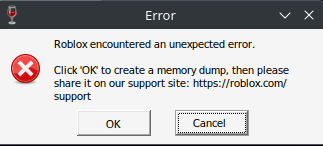

```{r include=FALSE}
library(tidyverse)
library(knitr)
library(rvest)
library(httr)
library(xml2)
library(jsonlite)
```

# THIS IS WIP!

This file (and full data) is available as a .Rmd file at <https://vinegarhq.org/VinegarSystemSurvey.Rmd>

## Background

The effort to run Roblox on Linux (hereafter abbreviated RoL) has faced many complications. Considering that the platform still does not have official support, nor even binaries built for x86_64 Linux, RoL wrappers including Grapejuice and Vinegar have had to run the Windows version of Roblox under the Wine compatibility layer, often leading to issues with Hyperion. Furthermore, as a result of Hyperion's vague messages and complexity, we are frequently unable to troubleshoot for problems on our users' systems.

An effort to "standardize" the platform on which Roblox runs has been made via distribution of RoL wrappers via the Flatpak packaging system, which provides a stable platform, but is still not always successful.

Additionally, some users on older processors without the AVX instruction set have reported being blocked by Hyperion.



## Why Merlin?

I chose to begin the Merlin project not only to gauge the minimum size of the RoL userbase of Vinegar, but also to identify the most popular distribution methods, kernels, and processors. The issue of statistics regarding AVX was also a major topic; I wanted to see how much of our userbase was affected, and whether more research was warranted.

The data collected included:

-   Vinegar Version (1.6.0 for all systems)

-   Kernel

-   Whether the user was using Flatpak

-   The presence of AVX

-   CPU Model

-   GPU driver name

The survey began on December 21, 2023.

## Limitations

While Merlin was designed to collect as much pertinent information as possible, our users were not willing to provide any identifiers, and were given the opportunity to chose to not participate.

Additionally, we were not able to identify whether Roblox Player was successful at launching on the system due to a lack of bindings to the Roblox executable, but are working on a fix for a future survey.

Our GPU data collection only includes driver name, but will be improved in a future release to collect actual model names.

## Results

The results of the survey can be retrieved at <https://merlin.vinegarhq.org>

```{r}
merlin <- read.csv("https://merlin.vinegarhq.org/")
head(merlin)
```

*A preview of the data.*

There are `r nrow(merlin)` submissions at the time of writing.

### Processor Model Statistics

```{r echo=FALSE}
merlin %>%
  group_by(cpu) %>%
    summarize(n = n()) %>%
      arrange(desc(n)) -> cpu_stats

cpu_stats$cpu_prop = cpu_stats$n / sum(cpu_stats$n)
cpu_stats$cpu_prop_as_perc = (cpu_stats$cpu_prop * 100)

kable(cpu_stats)
```

*cpu_prop indicates the proportion of the CPU model out of all models where a value of 1 = 100%, and cpu_prop_as_perc represents the same statistic as a percentage out of 100.*

Steam Decks are the largest group in the processor sample population, making up `r (sum(grepl('AMD Custom APU 0405|AMD Custom APU 0932', merlin$cpu)) / nrow(merlin)) * 100`% of submissions.

Considering the great number Steam Deck of users, Roblox may benefit from tapping into providing the userbase with a native binary. Additionally, Roblox's concerns over compatbility would be minimal on Steam Deck, as users not only have identical hardware, but are also only able to use Flatpak, ensuring a stable software platform.

### Processor Age Statistics

```{r include=FALSE}
amd_age_lookup <- function(cpuname) {
  ua <- user_agent("Mozilla/5.0 (X11; Linux x86_64; rv:60.0) Gecko/20100101 Firefox/81.0")
  cpuname <- str_remove(cpuname, regex("(\\h[0-9A-z]+-Core\\h.*| (with(.*)))"))
  cpuname_url_sani <- gsub(" ", "+", cpuname)
  
  # Navigate to JSON API page
  paste0("https://en.wikichip.org/w/api.php?action=opensearch&search=", cpuname_url_sani) %>%
    print() %>% # For debugging purposes...
      session(ua) -> json_page # JSON results page
  
  # Get results from JSON (Best effort...)
  json_page$response$content %>%
    rawToChar() %>% 
      fromJSON -> json_page
  
  json_page[[4]][1] -> cpu_page
  if (is.na(cpu_page)) { # Don't bother trying if no results.
    print("No results.")
    return(NA)
  }
  
  # Navigate to CPU page
  session(cpu_page, ua) %>% 
    session_follow_link(css = ".rdflink > a:nth-child(1)") -> rdf_page

  rdf_page$response$content %>%
    xml2::read_xml() %>%
    xml_find_first(xpath = "/rdf:RDF/swivt:Subject[1]/property:first_launched") %>%
    xml_text() %>%
    as.Date() -> release_date

  return(abs(as.numeric(difftime(release_date, Sys.Date(), unit="weeks")) / 52.25))
  # return the age of the CPU in years
}

cpu_stats$cpu_age_in_years <- as.numeric(NA)

for (x in 1:length(cpu_stats$cpu)) {
  print(paste0(((x / length(cpu_stats$cpu)) * 100),"% completed"))
  if (grepl("AMD", cpu_stats$cpu[x])) {
    try(
      cpu_stats$cpu_age_in_years[x] <- amd_age_lookup(cpu_stats$cpu[x])
    )
  }
  Sys.sleep(1.5)
}
```

```{r}
kable(cpu_stats)
```

### AVX Support

`r (sum((!as.logical(merlin$avx)) / nrow(merlin))) * 100`% of the Vinegar userbase does not have AVX.

While the probability of not having AVX is unusual (`r (sum((!as.logical(merlin$avx)) / nrow(merlin)))` \< 0.05), it is a non-zero value. We were not able to confirm whether those with AVX are able to successfully run RoL (as mentioned in [Limitations](#%20Limitations)). Consequently, we have decided to automatically provide a warning to users without AVX.

Whether AVX is the actual culprit for the issue with Hyperion is called into question by the results of this survey; more research is warranted, and insight from upstream developers (including from Wine and Roblox) would be beneficial.

### GPU Statistics

```{r echo=FALSE}
merlin %>%
  group_by(gpu) %>%
    summarize(n = n()) %>%
      arrange(desc(n)) -> gpu_stats

gpu_stats$gpu_prop = gpu_stats$n / sum(gpu_stats$n)
gpu_stats$gpu_prop_as_perc = (gpu_stats$gpu_prop * 100)

kable(gpu_stats)

```

While most systems have AMD, NVIDIA, or Intel GPUs (i915, nvidia, nouveau, radeon,amdgpu), `r (sum(!grepl("nouveau|nvidia|amdgpu|radeon|i915", merlin$gpu)) / nrow(merlin)) * 100`% of systems have virtualized or unknown graphics adapters (virtio-pci, vmwgfx, evdi, simple-framebuffer, ast, bochs-drm, qx1).

Additionally, `r (sum(grepl("nouveau", merlin$gpu)) / nrow(merlin)) * 100`% of users have the open-source nouveau driver, which is significantly inferior in performance to the proprietary NVIDIA driver.

The sizeable usage of irregular or poorly-performing drivers could explain performance issues affecting our userbase.

We are currently considering the feasibility of warning the user if an inferior driver is selected.

### Flatpak Usage

With `r (sum(as.logical(merlin$flatpak)) / nrow(merlin)) * 100`% of users on Flatpak, we are considering dropping support (but not discontinuing) for non-Flatpak installations. Non-Flatpak installations have been difficult to troubleshoot due to the irregularities between systems' Wine installations.

Additionally, the large percentage of individuals successfully on Flatpak may indicate its viability as a platform for official Roblox support.

## License

[Vinegar Merlin Hardware Survey Report (Dec 2023)](https://vinegarhq.org/VinegarSystemSurvey.html) © 2024 by [lunarlattice](https://github.com/lunarlettuce) is licensed under [CC BY-SA 4.0 ](http://creativecommons.org/licenses/by-sa/4.0/?ref=chooser-v1)
